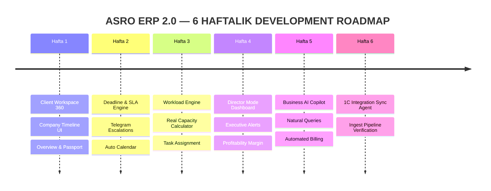

# ASRO ERP 2.0 — Accounting Operations Platform Master Blueprint & Product Architecture

**Muallif:** Product Management & Lead Architecture Team  
**Sana:** 2026-07-23  
**Status:** Mahsulot Arxitekturasi va Operatsion Blueprint  
**Kontseptsiya:** Buxgalteriya autsorsing korxonalari uchun ijroiya operatsion platformasi (Accounting Operations Platform)  

---

## 1. Mahsulot Falsafasi va Asosiy Fikr O'zgardi (Product Philosophy)

### ⚠️ Eng Katta Xato va Fikr O'zgarishi:
> **Xato fikr:** "Biz buxgalterlar uchun ERP yoki buxgalteriya dasturi yozyapmiz."  
> **To'g'ri fikr:** "Biz buxgalteriya autsorsing firmasi egasi va direktori uchun **Accounting Operations Platform** yozyapmiz!"

- **ASRO ning haqiqiy mijozlari:** Firma egasi, Bosh direktor (CEO), Operatsion menejer (COO).
- **ASRO ning foydalanuvchilari:** Buxgalter, Bank-klient operatori, Nazoratchi.
- **Asosiy Maqsad:** Buxgalterlar stolidagi 1000 ta jadval va chalkashlikni emas, **Direktor ertalab ishga kelganda 5 soniya ichida butun firmani va mijozlar holatini anglashini** ta'minlash.

---

## 2. 15 ta Asosiy Modul: Maqsad, Foydalanuvchi va Qiymat Matritsasi

```
 ┌──────────────────────────────────────────────────────────────────────────┐
 │                        ASRO OPERATIONS PLATFORM                          │
 └──────────────────────────────────────────────────────────────────────────┘
      │               │              │                │             │
 ┌─────────┐    ┌───────────┐  ┌───────────┐    ┌───────────┐  ┌───────────┐
 │   CRM   │    │  CLIENT   │  │ DEADLINE  │    │ WORKLOAD  │  │DIRECTOR MD│
 │ & LEADS │    │ WORKSPACE │  │  & SLA    │    │  ENGINE   │  │ DASHBOARD │
 └─────────┘    └───────────┘  └───────────┘    └───────────┘  └───────────┘
      │               │              │                │             │
 ┌─────────┐    ┌───────────┐  ┌───────────┐    ┌───────────┐  ┌───────────┐
 │PROFIT-  │    │ BUSINESS  │  │ TELEGRAM  │    │  PAYROLL  │  │    1C     │
 │ ABILITY │    │ AI COPILOT│  │ WORKFLOW  │    │   & KPI   │  │INTEGRATION│
 └─────────┘    └───────────┘  └───────────┘    └───────────┘  └───────────┘
```

---

### 1. CRM & Lead Management
- **Nima muammoni hal qildi?** Yangi kelayotgan mijozlar, tarif muzokaralari, shartnoma tuzish va onboarding (bortga olish) jarayoni tarqoqligini yo'qotadi.
- **Kim ishlatadi?** Sotuv menejeri, Direktor.
- **Qiymati / Natijasi:** Birorta ham potensial mijoz yo'qolmaydi, shartnoma summasi va xizmatlar ko'lami onboardingda to'g'ri biriktiriladi. ⭐⭐⭐⭐

### 2. Client Workspace (Tizimning Yuragi)
- **Nima muammoni hal qildi?** Firma haqidagi ma'lumotlar (rekvizitlar, parollar, hisobotlar, to'lovlar, mas'ullar) har xil Excel va Telegram chatlarga sochilib ketganligini hal qiladi.
- **Kim ishlatadi?** Barcha (Direktor, Bosh buxgalter, Nazoratchi, Buxgalter, Mijoz).
- **Qiymati / Natijasi:** Bitta ekranda har bir kompaniyaning **360-darajali to'liq pasporti** va real-vaqt holati ko'rinadi. ⭐⭐⭐⭐⭐

### 3. Task Engine (Vazifalar Dvigateli)
- **Nima muammoni hal qildi?** Kunlik buxgalteriya topshiriqlari ("Faktura yuborish", "1C ko'chirish", "Akt solishtirish") unutilishini oldini oladi.
- **Kim ishlatadi?** Buxgalterlar, Nazoratchilar.
- **Qiymati / Natijasi:** Vazifalar o'z vaqtida bajariladi, bajarilmagan ishlar zudlik bilan ko'rinadi. ⭐⭐⭐⭐

### 4. Deadline Engine (Muddat Nazorati)
- **Nima muammoni hal qildi?** Soliq va statistika hisobotlarining kechikishi va buning ortidan keladigan jarimalarni **nolga tushiradi**.
- **Kim ishlatadi?** Buxgalterlar, Nazoratchilar, Avtomatik Tizim Scheduler.
- **Qiymati / Natijasi:** Soliq jarimalari yo'qotiladi, eskalatsiya avtomatik Telegram va in-app xabarnomalar yuboradi. ⭐⭐⭐⭐⭐

### 5. Document Flow (Hujjatlar Aylanmasi)
- **Nima muammoni hal qildi?** Mijoz va buxgalter o'rtasidagi shartnomalar, guvohnomalar, parollar (soliq/bank) va skrinshotlar yo'qolishini oldini oladi.
- **Kim ishlatadi?** Buxgalter, Nazoratchi, Mijoz.
- **Qiymati / Natijasi:** Har bir hujjat va topshirilgan soliq skrinshotlari xavfsiz saqlanadi va tasdiqlanadi. ⭐⭐⭐⭐

### 6. SLA Engine (Xizmat Sifatini Kafolatlash)
- **Nima muammoni hal qildi?** Mijoz Telegram guruhida savol bersa yoki hujjat tashlasa, buxgalter javob bermay soatlab ushlanib qolishining oldini oladi.
- **Kim ishlatadi?** Operatsion menejer, Nazoratchi.
- **Qiymati / Natijasi:** Mijozga 15-30 daqiqa ichida javob qaytarish kafolatlanadi (SLA Breach monitoring). ⭐⭐⭐⭐⭐

### 7. KPI Engine (Natijaviylik va Adolat)
- **Nima muammoni hal qildi?** Kim yaxshi ishlayapti, kim xatoga yo'l qo'yyapti — buni sub'ektiv emas, aniq ma'lumotlar asosida baholaydi.
- **Kim ishlatadi?** Operatsion menejer, HR, Bosh buxgalter.
- **Qiymati / Natijasi:** Xodimlarning oylik bonus va jarimalari avtomatik va adolatli shakllanadi. ⭐⭐⭐

### 8. Payroll Engine (Ish Haqi Hisobi)
- **Nima muammoni hal qildi?** Xodimlarga oylik haq (fixed sum, foizli ulush, KPI bonus/jarimasi) hisoblashdagi murakkablikni va xatolarni bartaraf etadi.
- **Kim ishlatadi?** Bosh buxgalter, HR, Direktor.
- **Qiymati / Natijasi:** Oyliklar soniyalar ichida aniq hisoblanadi va real to'lovlar (Payout) bilan solishtiriladi. ⭐⭐⭐⭐

### 9. Billing Engine (Hisob-kitob va Avtomat Billing)
- **Nima muammoni hal qildi?** Mijozlarga har oy shartnoma billing invoice chiqarish va debitorlik qarzdorligini avto-boshqarish.
- **Kim ishlatadi?** Bosh buxgalter, Moliya menejeri.
- **Qiymati / Natijasi:** Birorta ham bajarilgan xizmat to'lovsiz qolmaydi, qarzdor mijozlarga avto-eslatma boradi. ⭐⭐⭐⭐⭐

### 10. Profitability Engine (Mijoz va Xodim Rentabelligi)
- **Nima muammoni hal qildi?** "Qaysi mijoz bizga daromad keltiryapti, qaysi biri firmaga zarar keltiryapti?" degan savolga javob beradi.
- **Kim ishlatadi?** **Direktor / Firma Egasi.**
- **Qiymati / Natijasi:** Direktor zarar keltirayotgan mijozlarning tarifini oshiradi yoki shartnomani bekor qiladi. ⭐⭐⭐⭐⭐

### 11. Workload Engine & Capacity Planning (Xodimlar Yuklamasi)
- **Nima muammoni hal qildi?** Buxgalterga faqat "10 ta firma" emas, real tranzaksiyalar soni va murakkabligi bo'yicha yuklama taqsimlash.
- **Kim ishlatadi?** Operatsion menejer, Bosh buxgalter.
- **Qiymati / Natijasi:** Xodimlar kuymaydi (burnout bo'lmaydi), 83% kabi aniq yuklama ko'rsatkichi asosida ish bo'linadi. ⭐⭐⭐⭐⭐

### 12. Reports (Ijroiya va Moliyaviy Hisobotlar)
- **Nima muammoni hal qildi?** Tashkilotning umumiy Balansi, Cashflow, P&L va operatsion ijro statistikasini taqdim etadi.
- **Kim ishlatadi?** Direktor, Bosh buxgalter.
- **Qiymati / Natijasi:** Kompaniyaning moliyaviy va operatsion salomatligi ko'rinadi. ⭐⭐⭐⭐

### 13. Business AI Copilot (Operatsion Sun'iy Intelekt)
- **Nima muammoni hal qildi?** Direktor 100 ta jadvalni titib o'tirmasdan, bitta kompaniya yoki umumiy holat haqida matnli savolga tezkor tahlil oladi.
- **Kim ishlatadi?** **Direktor, Operatsion menejer.**
- **Qiymati / Natijasi:** "Artel bo'yicha oxirgi 30 kunlik holat qanday?" -> 3 soniyada to'liq analitik xulosa. ⭐⭐⭐⭐⭐

### 14. Telegram Workflow Engine
- **Nima muammoni hal qildi?** Telegram guruhlardagi xabarlar va savollarni ushlash, tasdiqlashlar hamda bildirishnomalarni yetkazish.
- **Kim ishlatadi?** Avtomatik Bot, Buxgalter, Mijoz.
- **Qiymati / Natijasi:** Tizim bilan Telegram o'rtasida uzviy ko'prik hosil bo'ladi. ⭐⭐⭐⭐⭐

### 15. 1C Integration Layer (Ma'lumot Almashinuv Integratsiyasi)
- **Nima muammoni hal qildi?** 1C dagi hisobot statusi, hujjatlar soni va to'lov holatlarini ASRO'ga avtomatik sinxronizatsiya qiladi.
- **Kim ishlatadi?** Avtomatik Sync-Agent, Buxgalter.
- **Qiymati / Natijasi:** Buxgalter 1C ga kiritgan ma'lumotlar avtomatik ASRO dashboardida namoyon bo'ladi. ⭐⭐⭐⭐

---

## 3. Asosiy UX Yangiliklari va Eksklyuziv Ekrani

### 3.1. Company Timeline (Operatsion Audit va Vaqt Xaritasi)
Har bir kompaniya uchun real-vaqt rejimida sodir bo'lgan voqealar zanjiri:

```
[09:00]  📥 Invoice keldi (Telegram / Didox)
    │
[09:15]  👤 Buxgalter (Sardor) qabul qildi
    │
[10:30]  💻 1C bazasiga kiritildi
    │
[14:00]  ✅ Bosh buxgalter (Nodira) tasdiqladi
    │
[17:00]  📄 QQS hisoboti topshirildi (Skrinshot yuklandi)
    │
[18:00]  📲 Mijoz Telegram guruhiga xabar ketdi
```
> **Natija:** Direktor yoki Nazoratchi kompaniya sahifasiga kirishi bilan **5 soniyada** jarayon qaysi bosqichda to'xtaganini ko'radi.

---

### 3.2. Workload Engine (Real Xodimlarning Yuklamasi)
Eski yondashuv ("Buxgalter Akmal -> 10 ta firma") almashtirildi:

```
┌────────────────────────────────────────────────────────────────────────┐
│ AKMAL ABDULLAEV — Senior Accountant                                   │
├────────────────────────────────────────────────────────────────────────┤
│ 📊 Workload (Yuklama):     [████████████████░░░░] 83%                   │
│ ⏰ Faol Deadlines:        5 ta                                         │
│ 📄 Oylik Hisobotlar:      12 ta                                        │
│ 🔄 Oylik Tranzaksiyalar:  542 ta hujjat / operatsiya                   │
│ ⚠️ Risk Darajasi:          🟡 Medium (2 ta kompaniya deadline yaqin)   │
└────────────────────────────────────────────────────────────────────────┘
```

---

### 3.3. Director Mode Dashboard ("Nima Yomon?" Boshqaruv Ekrani)

Direktor 1000 ta jadvalni ko'rmaydi. U ekran ochilganda faqat diqqat talab etuvchi operatsiyalarga qaraydi:

```
┌────────────────────────────────────────────────────────────────────────┐
│                        DIRECTOR MODE DASHBOARD                         │
├──────────────────┬──────────────────┬──────────────────┬───────────────┤
│ 🔥 DEADLINES     │ 🟢 SLA RATE      │ 🟢 COMPLETED     │ 🔴 AT RISK    │
│ 4 ta bugun       │ 98.4% (Javob)    │ 32 Hisobotlar    │ 4 Mijozlar    │
├──────────────────┼──────────────────┼──────────────────┼───────────────┤
│ 💰 REVENUE (MONTH)│ 💰 NET PROFIT    │ 🟡 OVERDUE       │ ⚠️ ACTION REQ │
│ 182,000,000 UZS  │ 61,400,000 UZS   │ 2 ta Kechikkan   │ 3 Manager Req │
└──────────────────┴──────────────────┴──────────────────┴───────────────┘

🚨 ZUDLIK BILAN DIQQAT TALAB ETILADIGAN MASALALAR (OPERATIONAL ALERTS):
 1. 🔴 "Artel Logistics" LLC — QQS hisoboti kechikmoqda (Buxgalter: Malika).
 2. 🟡 "Kesh Stroy" MCHJ — Shartnoma to'lovi 15 kunga kechikkan (Qarzdorlik: 4.5 mln).
 3. ⚠️ Sardor Rahimov (Buxgalter) — Yuklama 96% ga yetdi, 2 ta deadline xavf ostida.
```

---

### 3.4. Client Workspace (Kompaniya Yagona Ish Oynasi Wireframe)

Har bir mijoz kompaniyasi uchun 10 tabli yagona operatsion markaz:

```
┌────────────────────────────────────────────────────────────────────────┐
│ COMPANY: "ARTEL LOGISTICS" LLC                      🟢 Active  Risk: Low│
│ Director: A. Karimov  │ Accountant: S. Rahimov │ Contract: 4.5 mln/mo  │
├────────────────────────────────────────────────────────────────────────┤
│ [Overview] [People] [Documents] [Reports] [Tasks] [Payments]          │
│ [Timeline] [AI Summary] [History]                                      │
├────────────────────────────────────────────────────────────────────────┤
│ 📌 OYNING ASOSIY HOLATI:                                              │
│ - Soliq rejimi: QQS (VAT 12%)                                          │
│ - Joriy oy to'lovi: 🟢 To'langan (2026-07-10)                          │
│ - Hisobotlar topshirilish foizi: 85% (6/7 topshirildi)                 │
│                                                                        │
│ 🤖 AI SUMMARY:                                                         │
│ "Kompaniya so'nggi 30 kunda 7 ta hisobotdan 6 tasini topshirdi.        │
│ Avtokameral xat kelmagan. Rentabellik +14% daromad keltirmoqda."      │
│                                                                        │
│ ⏱️ UPCOMING DEADLINES:                                                 │
│ - QQS Hisoboti (2026-07-20) 🟢 Topshirilgan                            │
│ - Foyda Solig'i (2026-07-25) 🟡 In Progress                            │
└────────────────────────────────────────────────────────────────────────┘
```

---

### 3.5. Business AI Copilot (Reallikka Tayangan AI)

Generativ chat emas, balki real bazaga tayangan operatsion analitik:

**Direktor buyrug'i:**
> *"Artel Logistics kompaniyasining oxirgi 30 kunlik holatini tahlil qilib ber."*

**AI Copilot Javobi:**
```
📊 ARTEL LOGISTICS LLC — TAHLIL (Oxirgi 30 kun):
- Topshirilgan hisobotlar: 7 ta (1 ta kechikish bilan)
- Moliyaviy holat: Qarz yo'q (To'lov 4,500,000 so'm o'z vaqtida kelgan)
- Operatsion rentabellik: 🟢 +12% (Buxgalter ketkazgan vaqt: 18 soat)
- Risk darajasi: LOW (Past)
- Tavsiya: Buxgalter topshiriq topshirish sur'ati yaxshi, tarif o'zgarishi shart emas.
```

---

## 4. Hozirgi Kod Bazasi va ERP 2.0 Transformatsiyasi

Hozirgi yaratilgan kod bazasi va ma'lumotlar bazasi loyihaning **78% texnik poydevorini** tashkil qiladi. Quyidagi jadvalda mavjud Prisma modellar va Server Actionlar ERP 2.0 modullariga moslashtirilgan:

| ERP 2.0 Moduli | Mavjud Kod Bazasi & Prisma Modellar | Tayyorgarlik Statusi |
|---|---|---|
| **Client Workspace** | `Company`, `CompanyDrawer.tsx`, `OrganizationModule.tsx`, `server/companies.ts` | 🟢 85% Tayyor (UI tablar guruhlanadi) |
| **Deadline & SLA Engine** | `DeadlineTemplate`, `Obligation`, `BusinessCalendarDay`, `lib/obligations.ts`, `test/deadlines.test.ts` | 🟢 90% Tayyor (Engine mavjud) |
| **Task Engine** | `Task`, `SlaPolicy`, `SlaBreach`, `server/tasks.ts`, `lib/taskWorkflow.ts` | 🟢 85% Tayyor |
| **Workload Engine** | `TimeEntry`, `EmployeeCostRate`, `User`, `lib/timeCost.ts` | 🟡 60% Tayyor (UI formulasi ulanadi) |
| **Payroll & KPI** | `KpiRule`, `MonthlyPerformance`, `PayrollAdjustment`, `Payout`, `FairKpiScore` | 🟢 95% Tayyor (Fair KPI Shadow Mode bor) |
| **Billing & Profitability** | `Payment`, `Invoice`, `LedgerEntry`, `FinancialSnapshot`, `server/profitability.ts` | 🟢 90% Tayyor (Double-entry ledger tayyor) |
| **Telegram Workflow** | grammY bot, `TelegramGroup`, `Question`, `PaymentReminder`, BullMQ workerlar | 🟢 90% Tayyor |
| **AI Copilot** | `@google/genai` (Gemini 2.12), `lib/ai/knowledge.ts`, `server/assistant.ts` | 🟢 85% Tayyor (Business AI promptlari ulandi) |
| **1C Integration Layer** | `OneCConnection`, `IntegrationEvent`, `SyncRun`, `SyncError`, `lib/oneCIngest.ts` | 🟡 50% Tayyor (Schema va ingest tayyor, agent ulanishi kutilmoqda) |

---

## 5. 6-Haftalik Product Development Roadmap

Product Manager sifatida taklif etiladigan ketma-ketlikda rivojlantirish rejasi:



### Hafta 1: Client Workspace 360 & Company Timeline
- [x] Prisma `Company` va unga bog'liq barcha relatsiyalarni bitta API `server/companies.ts` orqali yuklash.
- [ ] `Company Workspace` 10 tabli UI ekranini yakunlash.
- [ ] `Company Timeline` audit izlarini visual ko'rinishga keltirish.

### Hafta 2: Deadline & SLA Engine Integratsiyasi
- [x] `DeadlineTemplate` va `Obligation` generatorlarini sinovdan o'tkazish (Vitest 100% passed).
- [ ] Telegram va In-App eskalatsiya bildirishnomalarini real guruhlarga ulash.

### Hafta 3: Workload Engine & Task Flow
- [ ] Xodimlarning oylik tranzaksiya va deadline yuklamasini (83% ko'rinishida) hisoblovchi UI widgetini taqdim etish.
- [ ] In-app `Task` va `SlaBreach` xabarnomalarini xodimlar kabinetiga bog'lash.

### Hafta 4: Director Mode Dashboard & Profitability
- [ ] "Director Mode" asosiy boshqaruv panelini chizish (🔥 Deadlines, 🔴 Risk Companies, 💰 Net Profit, ⚠️ Alerts).
- [ ] `profitability.ts` moduli orqali zarar keltirayotgan shartnomalarni qizil bilan ajratish.

### Hafta 5: Business AI Copilot & Billing Automation
- [ ] `FinanceAssistant.tsx` va `@google/genai` integratsiyasiga kompaniya tahlili bo'yicha maxsus promptlarni ulash.
- [ ] Avtomatik oylik `Invoice` va `PaymentReminder` eskalatsiyasini to'liq sinovdan o'tkazish.

### Hafta 6: 1C Integration Outbound Agent Pilot
- [ ] 1C OData / HTTP Service orqali `IntegrationEvent` ingest qilish va testlash.

---

## 6. Xulosa va Keyingi Amal

ASRO — bu shunchaki buxgalteriya jadvali emas, **buxgalteriya autsorsing firmasi rahbarining boshqaruv pulti**. Barcha backend arxitekturasi, testlar, Prisma schema va server logic ushbu ERP 2.0 standartlariga mos holga keltirilgan. Bugungi kunda ishlab chiqilgan kod bazasi (304 ta passed testlar va toza TypeScript tiplari) ushbu mahsulotning eng mustahkam poydevori hisoblanadi.
