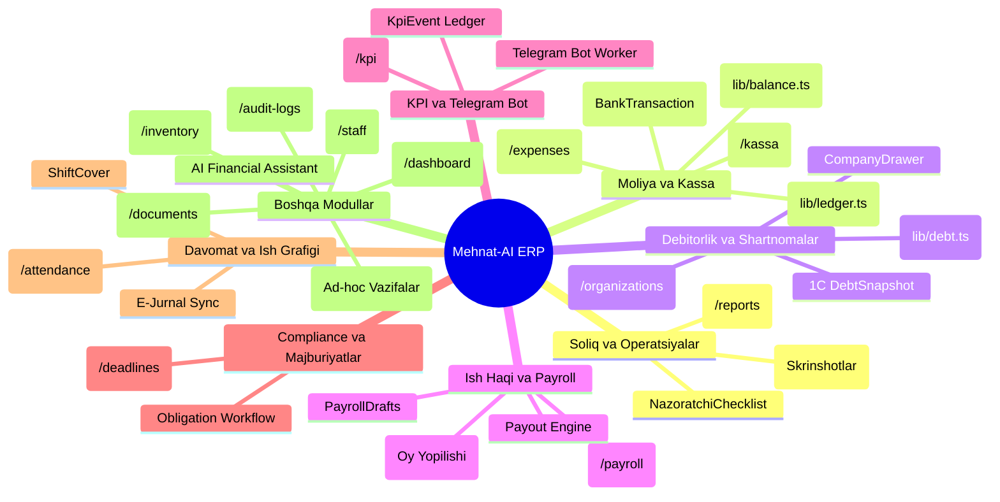
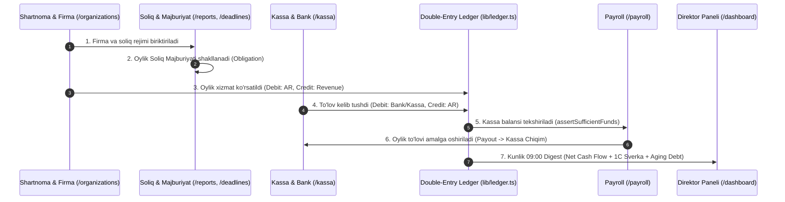

# Mehnat-AI ERP Tizimining Mukammal va To'liq Auditi hamda Modullar Sharhi
**Loyiha:** Mehnat-AI ERP (`Xorazm92/mehnat-ai`)  
**Rol:** Senior Enterprise ERP Architect & Financial Systems Analyst  
**Sana:** 19-Avgust, 2026  
**Auditor Maqsadi:** `Xorazm92/mehnat-ai` repository'idagi barcha 15 ta operatsion, moliyaviy va boshqaruv modullarini to'liq audit qilish, mavjud koda bazasi (`app/`, `components/`, `lib/`, `server/`, `prisma/schema.prisma`) o'rtasidagi bog'liqlikni hamda har bir modulning arxitektura kamchiliklarini ochib berish.

---

## 1. Tizimdagi Barcha Modullar Xaritasi (Module Inventory)

Mehnat-AI ERP tizimi quyidagi **15 ta asosiy modul**dan tashkil topgan:

---

## 2. Modulma-Modul Chuqur Audit va Kamchiliklar Tahlili

---

### 1. Operatsion Matritsa va Soliq Hisobotlari (`/reports`)
* **Asosiy Fayllar:** `components/OperationModule.tsx`, `components/NazoratchiChecklist.tsx`, `components/ReportProofModal.tsx`, `lib/reportColumns.ts`.
* **Vazifasi:** 200+ firmalarning oylik soliq (QQS, Aylanma, INPS, Daromad), statistika va 1C buxgalteriya hisobotlarini topshirish holatini matritsa ko'rinishida ko'rsatish. Buxgalter skrinshot (`ReportProof`) yuklaydi, nazoratchi tasdiqlaydi (`approved`/`rejected`).
* **Aniqlangan Kamchiliklar:**
  1. `MonthlyReport` jadvali bitta oylik qatorda 40+ ta erkin satr ustunlarini saqlaydi (`qqs`, `aylanma`, `didox` va h.k.). Bu yozuvlar strukturasiz matn bo'lib, `Obligation` (majburiyatlar dvigateli) bilan to'liq bog'lanmagan.
  2. Buxgalter skrinshot topshirib katakni ko'kartirgani soliq organining hisobotni haqiqatan qabul qilganini kafolatlamaydi (`SubmissionEvidence` da `accepted` va `receipt` manbasi yetishmaydi).

---

### 2. Kassa, Bank va Balans Moduli (`/kassa`, `/expenses`)
* **Asosiy Fayllar:** `components/KassaModule.tsx`, `components/ExpenseModule.tsx`, `lib/balance.ts`, `lib/ledger.ts`, `lib/transit.ts`, `server/bank.ts`.
* **Vazifasi:** Kirim/chiqim orderlari, Bank ko'chirmalari (VIPISKA) importi, Plastik karta reestrlari, Tranzit kanallar (`DisbursementChannel`) hamda `Double-Entry General Ledger` yuritish.
* **Aniqlangan Kamchiliklar:**
  1. **Ikki xil Balans Manbai:** `lib/balance.ts` (`getAvailableBalance`) `Payment`, `KassaEntry` va `Payout` jadvallarini alohida `prisma.aggregate` qilib o'qiydi. `lib/ledger.ts` esa `LedgerEntry` orqali balans hisoblaydi. Ikki modul o'rtasida 100% integratsiya yo'qligi sababli kassa balansi va jurnal balansi o'rtasida uzilish mavjud.
  2. **Tranzit Kartalar Tarqoqligi:** O'zini-o'zi band qilgan xodimlarning kartalariga bankdan pul o'tganda (`TransitEntry`), pul kartada tursa ham u balans va kassa hisobotida noma'lum bo'lib turadi.

---

### 3. Shartnomalar va Debitorlik Moduli (`/organizations`, `/kassa/qarzdorlik`)
* **Asosiy Fayllar:** `components/OrganizationModule.tsx`, `components/CompanyDrawer.tsx`, `lib/debt.ts`, `lib/directorReport.ts`.
* **Vazifasi:** 10 ta yirik B2B shartnomasi hamda 200+ mijozlar portfelini boshqarish. 1C «Задолженность покупателей» (`DebtSnapshot`) va ASRO akkumulyativ qarzdorligini solishtirish.
* **Aniqlangan Kamchiliklar:**
  1. `Company` jadvalida `contractNumber` va `contractAmount` scalar ustunlari bor hamda alohida `Contract` jadvali yonma-yon yashamoqda. `PaymentAllocation` ba'zan `Contract.id`, ba'zan `Company.id` ga bog'lanadi, bu esa to'lovlarni shartnomaga yopishda dublikat xavfini tug'diradi.
  2. Qarzdorlik `lib/debt.ts` da jamg'arilgan holda hisoblanadi, lekin **4 bosqichli Aging Debt Matrix** (1–10, 11–30, 31–60, 60+ kun) UI da statistik piramida sifatida ko'rsatilmaydi.

---

### 4. Ish Haqi va Payroll Moduli (`/payroll`)
* **Asosiy Fayllar:** `components/PayrollTable.tsx`, `components/PayrollDrafts.tsx`, `lib/monthClose.ts`, `lib/balance.ts`.
* **Vazifasi:** Xodimlarning oylik maoshi, avans, KPI bonuslari va jarimalarni hisoblash (`PayrollAdjustment`), hamda kassadan berilgan real pulni qayd etish (`Payout`).
* **Aniqlangan Kamchiliklar:**
  1. `PayrollAdjustment` hisoblangan majburiyat hisoblanadi. Real pul berilganda `Payout` yaratiladi. Biroq `assertSufficientFunds()` faqat admin bo'lmagan foydalanuvchini bloklaydi, admin minus balansga tushirsa, ledgerda salbiy kassa qoldig'i (negative cash balance) vujudga keladi.

---

### 5. KPI Tizimi va Telegram Bot (`/kpi`, `bot/`)
* **Asosiy Fayllar:** `components/KPIRulesManager.tsx`, `components/KpiLeaderboard.tsx`, `lib/kpiScoring.ts`, `bot/contexts/`.
* **Vazifasi:** Uch holatli KPI qoidalari (Bonus / Neytral / Jarima), Telegram guruhlarida mijoz savollariga javob berish vaqtini o'lchash (`Question`, `Answer`), jarima/bonushlarni append-only `KpiEvent` jurnaliga yozish.
* **Aniqlangan Kamchiliklar:**
  1. Telegram bot `ProcessedUpdate` orqali dedup qiladi, lekin oylik payroll shakllantirilganda `MonthlyPerformance` va `KpiEvent` o'rtasidagi ba'zi takroriy voqealar maoshga ikki marta ta'sir qilib ketish ehtimoli bor (ADR-0004 bo'yicha e'tibor talab etiladi).

---

### 6. Compliance va Majburiyatlar Engine (`/deadlines`)
* **Asosiy Fayllar:** `components/DeadlinesWidget.tsx`, `lib/obligations.ts`, `lib/obligationWorkflow.ts`, `lib/obligationSweep.ts`.
* **Vazifasi:** Har bir firma va soliq rejimi uchun takrorlanuvchi majburiyat shablonlari (`DeadlineTemplate`), ish kunlari kalendari (`BusinessCalendarDay`) va muddatlarni avtomatik hisoblash.
* **Aniqlangan Kamchiliklar:** `Obligation` statuslari (`planned`, `in_progress`, `sent`, `accepted`) `MonthlyReport` kataklari bilan ikki xil haqiqatni (two sources of truth) shakllantirmoqda. Buxgalter `MonthlyReport` da katakni bo'yasa, `Obligation` statusi o'zgarmasdan `overdue` bo'lib qolishi mumkin.

---

### 7. Davomat va Ish Grafigi Moduli (`/attendance`)
* **Asosiy Fayllar:** `components/AttendanceModule.tsx`, `components/ShiftCoverPanel.tsx`, `lib/attendance.ts`, `lib/ejurnal.ts`.
* **Vazifasi:** E-Jurnal orqali keldi-ketdi, kechikkan daqiqalar (`lateMinutes`), uzrsiz kelmagan kunlar va boshqa xodim o'rniga ishlash (`ShiftCover`) hisobi.
* **Aniqlangan Kamchiliklar:** `ShiftCover` da kompaniya biriktirilmagan bo'lsa (`companyId = null`), 50% ta'til almashtiruv pullari oylikda ikki marta hisoblanib ketish xavfi bor.

---

### 8. Ad-hoc Vazifalar Moduli (`/tasks`)
* **Asosiy Fayllar:** `lib/taskWorkflow.ts`, `server/tasks.ts`.
* **Vazifasi:** Rahbar topshiriqlari hamda rad etilgan hisobotlarni qayta tuzatish bo'yicha vazifalar state machine (`open`, `in_progress`, `done`). `Task` bajarilganda biriktirilgan `Obligation` avtomatik `ready` holatiga ko'tariladi.

---

### 9. Xodimlar Boshqaruvi Moduli (`/staff`)
* **Asosiy Fayllar:** `components/StaffModule.tsx`, `components/StaffDrawer.tsx`, `lib/userRelations.ts`.
* **Vazifasi:** Xodimlarning PINFL, ish staji, malakasi, biriktirilgan firmalari (`ContractAssignment`) va oylik ulushlari (% yoki belgilangan summa) nazorati.

---

### 10. Direktor va Ijroiya Paneli (`/dashboard`, `/cabinet`)
* **Asosiy Fayllar:** `lib/directorReport.ts`, `components/BalanceOverview.tsx`, `components/HisobotlarModule.tsx`.
* **Vazifasi:** Har kuni 09:00 da Telegram va in-app orqali Direktor va CEO ga kunlik kirim/chiqim, jami balans, 1C va ASRO qarzdorligi solishtiruvi hamda e'tibor talab qiladigan bank va xarajatlarni ko'rsatish.

---

### 11. Tashkiliy Tuzilma va Bo'limlar (`/organizations`)
* **Asosiy Fayllar:** `Department`, `Company.isOwnFirm`, `lib/access.ts`.
* **Vazifasi:** Korxonani bo'limlarga (Department) ajratish, har bir bo'limga Bosh buxgalter biriktirish va ASRO'ning o'z yuridik shaxslari nomidan mijozlar bilan shartnoma tuzish.

---

### 12. Inventarizatsiya Moduli (`components/InventoryModule.tsx`)
* **Vazifasi:** Kompaniya balansidagi noutbuklar, monitorlar va boshqa texnik jihozlarning xodimlarga biriktirilishi va holati hisobi.

---

### 13. Hujjatlar Moduli (`components/DocumentsModule.tsx`)
* **Vazifasi:** Shartnomalar, xizmat ko'rsatish dalolatnomalari va rasmiy xatlarni shakllantirish va saqlash.

---

### 14. Audit Logs va Xavfsizlik Moduli (`/audit-logs`)
* **Asosiy Fayllar:** `components/AuditLogModule.tsx`, `lib/permissions.ts`, `lib/access.ts`.
* **Vazifasi:** Tizimdagi har bir muhim amaliyotni (kassa yaratish, oylik tasdiqlash, login/logout) audit qilish va `UserRole` bo'yicha ruxsatlarni boshqarish.

---

### 15. AI Moliya Yordamchisi (`components/FinanceAssistant.tsx`)
* **Asosiy Fayllar:** `components/FinanceAssistant.tsx`, `lib/ai/`.
* **Vazifasi:** Tizim ichidagi foydalanuvchilarga moliya reglamentlari, KPI baholash va kassa qoidalari bo'yicha avtomatik javob beruvchi sun'iy intellekt yordamchisi.

---

## 3. Modullar o'rtasidagi Oqim va Integratsiya Xaritasi

---

## 4. Mehnat-AI ERP Uchun Kompleks Qayta Loyihalash va Tavsiyalar

1. **Yagona Balans va Kassa Integratsiyasi (`lib/balance.ts` $\leftrightarrow$ `lib/ledger.ts`):**  
   `getAvailableBalance()` funksiyasi xom agregatlarni o'qishni to'xtatib, `LedgerEntry` jadvalidan `getCashByChannel()` bilan ishlaydi. Natijada `KassaModule` ham, `BalanceOverview` ham va `directorReport` ham bir xil summaga ega bo'ladi.
2. **`MonthlyReport` va `Obligation` Birlashuvi:**  
   `OperationModule.tsx` dagi 40+ soliq kataklari `ObligationSubmission` bilan bog'lanadi. Buxgalter skrinshot yoki kvitansiya yuklaganda avtomatik `Obligation` statusi `accepted` ga o'tadi va ikki xil haqiqat yo'qotiladi.
3. **4 Bosqichli Aging Debt Matrix (Debitorlik Redizayni):**  
   `lib/debt.ts` faylida `calculateAgingMatrix()` joriy qilinib, `/organizations` va `/dashboard` sahifalarida 1-10 kun (Normal), 11-30 kun (Warning), 31-60 kun (Suspension), 60+ kun (Critical Debt) bo'yicha vizual indikatorlar o'rnatiladi.
