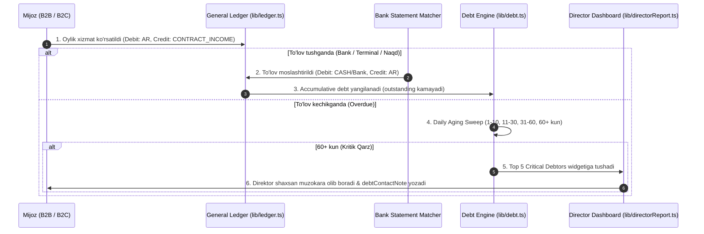

# Mehnat-AI ERP Moliyaviy va Kassa Modulining Chuqur Kodi Audit Hujjati va Redizayn Spetsifikatsiyasi

> **Holat: TARIX** · 2026-08-19 — o'sha kungi tashxis — bugungi kod bilan qayta solishtirilmagan.
> Tashqi generator yozgan; “ERP” ramkasi [`docs/PRODUCT.md`](../PRODUCT.md) bilan ziddiyatda.
> Amaldagi hujjatlar xaritasi: [`docs/README.md`](../README.md)

**Loyiha:** Mehnat-AI ERP (`Xorazm92/mehnat-ai`)  
**Rol:** Senior Enterprise ERP Architect & Financial Systems Analyst  
**Sana:** 19-Avgust, 2026  
**Auditor Maqsadi:** Tizimdagi mavjud TypeScript modullari (`lib/balance.ts`, `lib/ledger.ts`, `lib/debt.ts`, `lib/directorReport.ts`), Prisma Schema (`prisma/schema.prisma`) va UI komponentlarini (`HisobotlarModule.tsx`) chuqur audit qilish, dublikat va tarqoq kassa yozuvlarini bartaraf etish hamda 6 ta modul bo'yicha mukammal texnik va arxitektura yechimini berish.

---

## 1. Mavjud Koda Audit va Tizimdagi Muammolar Tahlili

### 1.1. Balans va Kassa Tarqoqligi Audit (`lib/balance.ts` vs `lib/ledger.ts`)
* **Mavjud holat:** `lib/balance.ts` `getAvailableBalance()` funksiyasi mavjud mablag'ni hisoblashda 4 ta alohida jadval agregatsiyasini o'qiydi:
  `Payment` (paid/partial) + `KassaEntry` (income) − `KassaEntry` (approved expense) − `Payout` (paid).
* **Kritik Gaps:** 
  1. `lib/balance.ts` va `lib/ledger.ts` o'rtasida **ma'lumot uzilishi** bor. `lib/ledger.ts` yagona ikki yoqlama yozuv (Double-Entry) jurnalini shakllantiradi, lekin `getAvailableBalance()` `LedgerEntry` jadvalidan ERMAS, birlashtirilmagan manbalardan o'qiydi.
  2. `DisbursementChannel` (tranzit kartalar, xodim kartalari) bo'yicha pul `TransitEntry` orqali kartaga o'tganda (`direction = 'in'`), pul hali sarflanmagan bo'lsa ham `KassaEntry` yozilmaydi, natijada kassa balansi bilan real bank/karta balansi bir-biriga mos kelmaydi.
  3. `KassaEntry.channelId` maydoni eski yozuvlarda `null` qolgan, bu esa pulning "qaysi kassada" ekanligini ko'rsatuvchi `getCashByChannel()` hisobotida noma'lum qoldiq hosil qiladi.

### 1.2. Debitorlik Qarzdorligi Tahlili (`lib/debt.ts` Audit)
* **Mavjud holat:** `lib/debt.ts` akkumulyativ hisob modeliga o'tkazilgan (`computeCompanyDebt`): `charged` (boshlang'ich qarz + oylik shartnoma summasi) minus `paid` (tushgan to'lovlar).
* **Kritik Gaps:**
  1. `lib/debt.ts` qarzdorlikni `outstanding` (jami qoldiq) va `overdue` (o'tgan oylardan kechikkan qarz)ga ajratadi, lekin rahbariyat talab qilgan **4 bosqichli Aging Debt Matrix** (1–10 kun, 11–30 kun, 31–60 kun, 60+ kun) bo'yicha toifalash va statistik piramida mavjud emas.
  2. `Company` modelida `debtContactedAt`, `debtNextContactAt`, `debtContactNote` ustunlari bor, lekin 60+ kunlik **Kritik Qarzdorlar** bilan muloqot qilmaslik holatida avtomatik eskalatsiya yoki muzokara majburiyligi mantiqan qulflanmagan.

### 1.3. Shartnoma va Kontragentlar Ma'lumotlar Dublikatsiyasi
* **Mavjud holat:** `Company` modelida `contractNumber`, `contractAmount`, `contractDate` scalar ustunlari hamda alohida `Contract` modeli (`companyId`, `number`, `amount`, `openingDebt`) yonma-yon yashamoqda.
* **Kritik Gaps:** `PaymentAllocation` jadvali `contractId` orqali to'lovni biriktirsa, eski kodlar `Company.id` ni o'qimoqda. Natijada bitta mijozda 2 ta shartnoma bo'lsa, to'lov qaysi shartnomani yopayotgani chalg'iydi.

---

## 2. Modulma-Modul Mukammal Qayta Loyihalash (100% Mehnat-AI Koda Baza Asosida)

---

### Modul 1: Kontragentlar va Shartnomalar (Contracts & Counterparties)

#### Codebase Redizayni (`prisma/schema.prisma` va `lib/companySearch.ts`):
1. **Normallashtirish:** `Company` modelidagi `contractNumber` va `contractAmount` scalar ustunlari DEPRECATED qilinadi va barcha shartnomalar `Contract` modeliga o'tkaziladi.
2. **Payment Terms va Credit Limit:** `Contract` modeliga 5 kunlik avans va 15 kunlik post-to'lov hamda kredit limiti qo'shiladi:

```prisma
// prisma/schema.prisma ga kiritiladigan o'zgartirishlar:
enum PaymentTermType {
  ADVANCE_5_DAYS   // Xizmatdan 5 kun oldin to'lov
  POSTPAY_15_DAYS  // Oy tugagach 15 kun ichida
  CUSTOM
}

model Contract {
  id                String          @id @default(uuid())
  companyId         String
  company           Company         @relation("ClientContracts", fields: [companyId], references: [id], onDelete: Cascade)
  ownFirmId         String?
  ownFirm           Company?        @relation("OwnFirmContracts", fields: [ownFirmId], references: [id], onDelete: SetNull)
  number            String
  signedAt          DateTime?
  amount            Decimal?        @db.Decimal(14, 2)
  paymentTerm       PaymentTermType @default(POSTPAY_15_DAYS)
  creditLimit       Decimal         @default(0) @db.Decimal(14, 2)
  currency          String          @default("UZS")
  isActive          Boolean         @default(true)
  openingDebt       Decimal?        @db.Decimal(14, 2)
  openingDebtAt     DateTime?
  createdAt         DateTime        @default(now())
  updatedAt         DateTime        @updatedAt

  allocations       PaymentAllocation[]
  bankTransactions  BankTransaction[]
  debtSnapshots     DebtSnapshot[]

  @@unique([companyId, number])
  @@index([companyId])
}
```

3. **Anti-Duplication (STIR/JSHSHIR):** B2B yuridik korxonalar `inn` bo'yicha unique index orqali nazorat qilinadi. B2C jismoniy mijozlar uchun `pinfl` yoki `phoneNormalized` unikal kalit sifatida xizmat qiladi.

---

### Modul 2: Kassa va Hisob-raqamlar (Accounts & Wallets)

#### Codebase Redizayni (`lib/balance.ts` va `lib/transit.ts`):
1. **Single Source of Truth Balans:** `lib/balance.ts` ichidagi `getAvailableBalance()` Prisma agregatlari o'rniga `lib/ledger.ts` dagi `getLedgerCashBalance()` va `getCashByChannel()` dan foydalanishga o'tkaziladi. Bu kassa va balans hisobotlarining 100% bir xil raqam ko'rsatishini kafolatlaydi.

```typescript
// lib/balance.ts qayta qilingan yagona balans funksiyasi:
import { getLedgerCashBalance, getCashByChannel } from "@/lib/ledger";

export async function getUnifiedAvailableBalance(db: Db = prisma) {
  const totalBalance = await getLedgerCashBalance(db);
  const channelBalances = await getCashByChannel(db);
  return {
    totalBalance,
    byChannel: channelBalances,
  };
}
```

2. **Inkassatsiya va Ichki O'tkazmalar (Internal Transfer):**
   Filial kassasidan Asosiy kassaga yoki Naqd kassadan Bank hisob-raqamiga pul o'tkazilganda `postLedger` atomar tranzaksiyasi chaqiriladi:
   * **Debit:** Destination Channel (masalan `BANK_UZS`)
   * **Credit:** Source Channel (masalan `MAIN_CASH`)
   * Korxona umumiy aktiv balansi o'zgarmaydi, faqat kanallar kesimi yangilanadi.

---

### Modul 3: Tranzaksiyalar va Kassa Daftari (General Ledger / Transactions)

#### Codebase Redizayni (`lib/ledger.ts` va `lib/monthClose.ts`):
1. **Hisoblar Rejasini Kengaytirish:** `ACCOUNTS` obyektiga Debitorlik qarzi (`ACCOUNTS_RECEIVABLE`) va Bank Hisoblari qo'shiladi:

```typescript
// lib/ledger.ts
export const ACCOUNTS = {
  CASH: "CASH",                         // Kassa va Bank kanallari (Aktiv)
  ACCOUNTS_RECEIVABLE: "ACCOUNTS_RECEIVABLE", // Mijozlar debitorlik qarzi (Aktiv)
  CONTRACT_INCOME: "CONTRACT_INCOME",   // Xizmat ko'rsatishdan daromad (Passiv/Daromad)
  KASSA_INCOME: "KASSA_INCOME",         // Boshqa kassa kirimlari
  OPERATING_EXPENSE: "OPERATING_EXPENSE",// Operatsion xarajatlar
  SALARY_EXPENSE: "SALARY_EXPENSE",     // Oylik va mukofot xarajatlari
} as const;
```

2. **Avtomatik Double-Entry Yozuvi:**
   * **Oylik xizmat hisobi shakllanganda:**  
     `Debit: ACCOUNTS_RECEIVABLE (subjectId: companyId)` $\rightarrow$ `Credit: CONTRACT_INCOME`
   * **Mijoz to'lov qilganda (`Payment` / `PaymentAllocation`):**  
     `Debit: CASH (channelId: bank/kassa)` $\rightarrow$ `Credit: ACCOUNTS_RECEIVABLE (subjectId: companyId)`
3. **Immutability & Reversal:** `reverseLedger()` funksiyasi orqali har bir bekor qilingan to'lov teskari yozuv (`sourceTable + '-reversal'`) bilan append-only usulida nollashtiriladi.

---

### Modul 4: Debitorlik va Qarzdorlik Tahlili (Debt & Aging Analysis)

#### Codebase Redizayni (`lib/debt.ts` va `lib/directorReport.ts`):
1. **Aging Debt Matrix (4 Bosqichli Taqsimot):**
   `computeCompanyDebt()` funksiyasi quyidagi 4 ta toifani hisoblab beradi:

```typescript
// lib/debt.ts ga qo'shiladigan Aging Debt Matrix funksiyasi:
export interface AgingMatrixBreakdown {
  normal_0_10: number;       // 1-10 kun: Joriy to'lovlar (Normal)
  warning_11_30: number;     // 11-30 kun: Ogohlantirish (Menejer nazorati)
  suspension_31_60: number;  // 31-60 kun: Xizmat to'xtatish xavfi
  critical_60_plus: number;  // 60+ kun: KRITIK QARZDORLAR (Direktor muzokarasi)
}

export function calculateAgingMatrix(debtors: DebtorRow[]): AgingMatrixBreakdown {
  const matrix: AgingMatrixBreakdown = {
    normal_0_10: 0,
    warning_11_30: 0,
    suspension_31_60: 0,
    critical_60_plus: 0,
  };

  for (const d of debtors) {
    if (d.overdue <= 0) {
      matrix.normal_0_10 += d.dueNow;
    } else if (d.monthsOverdue <= 1) {
      matrix.warning_11_30 += d.overdue;
    } else if (d.monthsOverdue <= 2) {
      matrix.suspension_31_60 += d.overdue;
    } else {
      matrix.critical_60_plus += d.overdue;
    }
  }

  return matrix;
}
```

2. **Kritik Qarzdorlar Boshqaruv Logi:** 60 kundan oshgan qarzdorlar uchun `Company.debtContactedAt`, `debtNextContactAt` va `debtContactNote` ustunlari majburiy qilinadi va har kuni 09:00 dagi `runDirectorReport()` bot digestiga kiritiladi.

---

### Modul 5: Analitika va Boshqaruv Paneli (Executive Dashboard)

#### Codebase Redizayni (`lib/directorReport.ts` va `components/HisobotlarModule.tsx`):
1. **Davriy Filtrlar:** `1-19 Avgust` (MTD), `1-Yanvardan bugungacha` (YTD) va `Kastom oraliq` bo'yicha dinamik filterlar.
2. **Dashboard Data Structure:**

```typescript
// app/api/dashboard/executive-summary/route.ts uchun javob formati:
export interface ExecutiveDashboardData {
  period: { startDate: string; endDate: string };
  cashFlow: {
    totalInflow: number;
    totalOutflow: number;
    netCashFlow: number;
  };
  inflowChannelsShare: {
    bankTransfer: { amount: number; percentage: number };
    terminal: { amount: number; percentage: number };
    cash: { amount: number; percentage: number };
  };
  agingDebt: AgingMatrixBreakdown;
  top5CriticalDebtors: DebtorRow[];
}
```

---

### Modul 6: Ruxsatlar va Xavfsizlik (RBAC - Role-Based Access Control)

#### Codebase Redizayni (`lib/permissions.ts` va `lib/access.ts`):
1. `UserRole` enumiga `cashier` rolini kiritish va amallarni cheklash:
   * **Kassir (`cashier`):** Faqat kassa kirim/chiqimlarini kiritish va smena yopish. Moliyaviy snapshotlar va P&Lni ko'ra olmaydi.
   * **Menejer (`supervisor`):** Faqat o'ziga biriktirilgan mijozlar debitorligini ko'rish va `debtContactNote` yozish.
   * **Bosh Buxgalter (`chief_accountant`):** Bank tranzaksiyalarini solishtirish, `postLedger` stornolarini bajarish, oylik yopish (`monthClose.ts`).
   * **CEO / Admin (`super_admin`):** To'liq konsolidatsiya paneli, 10M so'mdan yuqori chiqimlarni tasdiqlash, Kritik qarzdorlar ro'yxatini nazorat qilish.

---

## 3. Biznes-Jarayonlar Xaritasi (Sequence Workflow)



---

## 4. Mehnat-AI Loyihasi Uchun Muammolarni Yo'qotish Bo'yicha Texnik Ko'rsatmalar

1. **`lib/balance.ts` va `lib/ledger.ts` Unifikatsiyasi:**  
   `getAvailableBalance()` funksiyasi backend `LedgerEntry` balance aggregatiga bog'lanadi. Bu orqali 3 ta alohida SQL so'rov o'rniga bitta yagona Bosh Daftar ko'rsatkichi ishlatiladi.
2. **SHA-256 Deduplication Key:**  
   `BankTransaction` va `KassaEntry` larda `dedupKey` (`bank:<accountId>:<date>:<docNum>:<amount>`) orqali qayta to'lov kiritilishi 100% bazaviy unikal indeks darajasida to'siladi.
3. **1C va ASRO Sverka Avtomatizatsiyasi:**  
   `lib/directorReport.ts` dagi `debt1CWithComparable()` funksiyasi orqali har kuni 1C «Задолженность покупателей» snapshoti ASRO `computeContractDebt()` ko'rsatkichi bilan avtomatik taqqoslanib boriladi.
